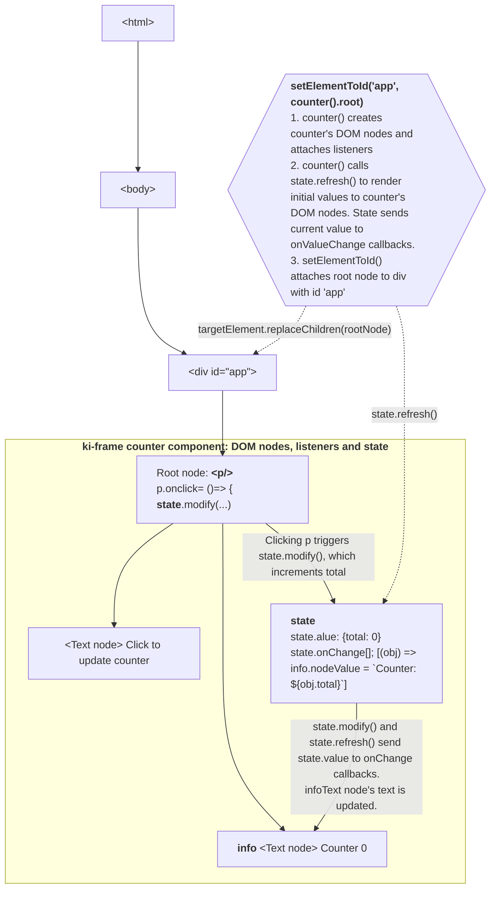
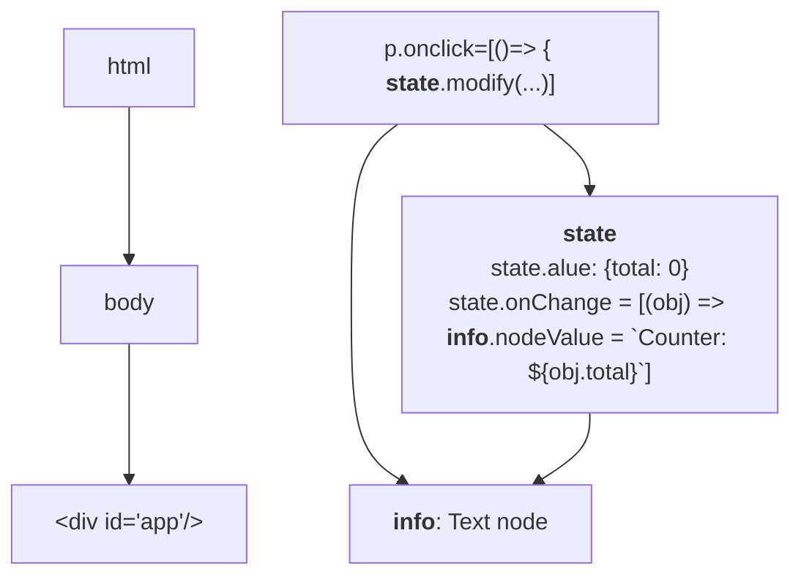
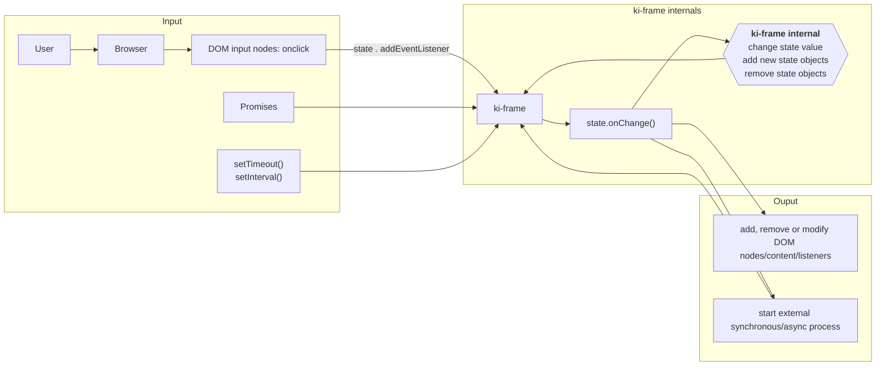
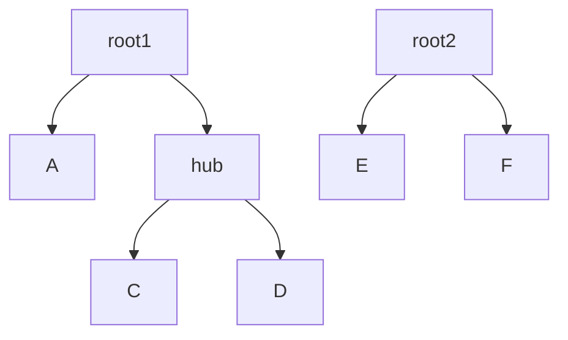

**ki-frame**

Lightweight but all batteries included browser framework for implementing SPAs. Code with DOM elements and listeners
like it's 2010 again, but with better tooling.

<!-- TOC -->

* [Features, status and todo per feature](#features-status-and-todo-per-feature)
* [How are you supposed to use this?](#how-are-you-supposed-to-use-this)
    * [Use fluent syntax to create DOM trees](#use-fluent-syntax-to-create-dom-trees)
    * [Use createState() and state.onChange()](#use-createstate-and-stateonchange)
    * [How is the code linked to DOM nodes in memory?](#how-is-the-code-linked-to-dom-nodes-in-memory)
    * [How to structure code?](#how-to-structure-code)
    * [How to test?](#how-to-test)
* [ki-frame programming model](#ki-frame-programming-model)
    * [GC strategies](#gc-strategies)
        * [GC related tooling](#gc-related-tooling)
    * [State broadcast events](#state-broadcast-events)
    * [State API](#state-api)
    * [No external dependencies -> automatic clean up with GC](#no-external-dependencies---automatic-clean-up-with-gc)
    * [Registered event sources and automatic cleanup on state.destroy()](#registered-event-sources-and-automatic-cleanup-on-statedestroy)
    * [createState({}, {weakRef: true})) and state.withStrongRefs(strongRefState => {...})](#createstate-weakref-true-and-statewithstrongrefsstrongrefstate--)
    * [Automatic cleanup](#automatic-cleanup)
    * [Event propagation and state data sharing](#event-propagation-and-state-data-sharing)
    * [Linked items](#linked-items)
    * [State and DOM node life cycle events](#state-and-dom-node-life-cycle-events)
        * [Pyramid shape for event propagation](#pyramid-shape-for-event-propagation)
        * [Hierarchy and grouping](#hierarchy-and-grouping)
    * [Sharing state data](#sharing-state-data)
* [TODO](#todo)
* [References in browser apps](#references-in-browser-apps)
    * [DOM event listeners](#dom-event-listeners)
    * [Callback-based triggering](#callback-based-triggering)
    * [WeakRef](#weakref)
    * [Avoid: Top level const/let and window.state](#avoid-top-level-constlet-and-windowstate)
* [Legend for icons](#legend-for-icons)

<!-- TOC -->

# Features, status and todo per feature

* [domBuilder.ts](src/domBuilder.ts) ✅
    * wrapper for document.createElement() to create DOM trees fluently
* [state.ts](src/state.ts)
    * main concept for coordinating ki-frame components and applications
    * maintains the state object, which is a single typed value (state.value) ✅
    * manages input & output connections 🛠️
        * input event listeners (DOM events, ongoing fetches and other promises, timers) 🛠️
        * sending broadcast events to subscribed DOM nodes and linked other states 🔥
    * logging of relevant events 🔥
    * maintains overview of all relevant items 🛠️
        * input listeners 🛠️ and broadcast targets 🔥
        * links with other states 🔥
            * with shared value
            * linked event propagation
        * channels
    * supports automatic and semi-automatic removal strategies:
        * local ✅
            * dependencies are not shared beyond a root DOM node. GC can remove everything when the root node is removed
              from the DOM tree.
        * manual ✅
            * registration + state.destroy()
        * weakRef 🛠️
        * onRemoveDestroy(node) - MutationObserver 🛠️
        * GC strategy assertions
* fetch and XHR integration 🔥
    * state.destroy() aborts ongoing fetches and XHRs
* form support 🔥
    * how forms and validation should work with state?
* router - tigher integration with browser urls ⭐
    * initialize application based on route parameters
    * control application url and actions based on user actions
    * port of https://github.com/mikko-apo/ki-router.js
    * work has not started
* testing ✅
    * unit testing
        * ki-frame is composed with listener functions which can be easily unit tested
    * snapshot tests
        * generated DOM tree
        * updated DOM tree
    * headless integration testing with jsdom
        * components and even apps can be tested with jsdom.
        * DOM events can be triggered to simulate user actions in a browser

# How are you supposed to use this?

## Use fluent syntax to create DOM trees

1. create DOM node trees with the fluent syntax. Extract a variable for each HTMLElement or Text node that you want
   access
   separately. Pass the variables how you want.

```typescript
import {a, p, setElementToId} from "./domBuilder";

const a1 = a("test link", {href: "/pow.html"});
setElementToId('app', p("POW!", a1, {onclick: () => console.log("pow.html")}));
```

## Use createState() and state.onChange()

If you need state, use createState({}) to create a typed state object. It's ok to share the state object
reference inside the application to other functions and DOM nodes. Use state.onChange() to react to changes in state.

State supports following functions for setting and notifying of state change:

- state.set(cur)
- state.modify(fn: (old) => cur)
- state.onChange(fn: (cur, old) => void): () => void

```typescript
import {p, setElementToId, text} from "./domBuilder";
import {createState} from "./state";

const createNodes = () => {
  const info = text();
  const root = p("Click to update counter", info);
  return {info, root};
};

function counter(state = createState({total: 0})) {
  const nodes = createNodes();
  nodes.root.onclick = () => state.modify((cur) => ({total: cur.total + 1}));
  state.onValueChange((obj) => (nodes.info.nodeValue = `Counter: ${obj.total}`));
  state.refresh();
  return nodes;
}

setElementToId('app', counter().root);
```

Example above forms following DOM nodes:

- &lt;p/> with onclick
    - Text node: "Click to update counter"
    - Text node: ""

In the initialization code, state.refresh() calls state's onChange listeners and text is included in to the Text node:

- &lt;p/> with onclick
    - Text node: "Click to update counter"
    - Text node: "Counter: 0"

&lt;p/> is attached to page DOM as a child of element with id 'app'.

Clicking on p increments counter with the help of the state:

- &lt;p/> with onclick
    - Text node: "Click to update counter"
    - Text node: "Counter: 1"

## How is the code linked to DOM nodes in memory?



When everything linked to the state is attached under a single DOM node, state will get cleaned up by the GC when the
root DOM node is removed from the main DOM tree. ki-frame has tools to support more complex scenarios where state
and events are shared between components, but the above approach should work for most cases.

For long-lived state objects, it might be beneficial to limit the creation of onChange() subscriptions. It's easy to
unsubscribe the onChange() subscriber, but it's difficult to maintain DOM node specific listeners over a complex code
base so leaks can become substantial if the onChange() is subscribed frequently for long-lived state objects.

## How to structure code?

For a single function:

- **parameters**: state objects (with types and default value in the signature), channels, functions (subcribe to
  onChange, onDestroy, unsubscribe)
- **body**: DOM structure setup, (initialize state,) connect subscribers, (render content with state.refresh())
- **return**: root node, newly created state objects (only if someone needs access), relevant nodes from testing

For reuse:

- extract DOM structure setup to its own function
- pass in state as parameter. other shared things can be given as parameters

For testing:

- extract subscribers to own functions and unit test each function separately
- snapshot DOM structure

Example:

```typescript
// DOM structure setup for testing
const createNodes = () => {
  const info = text();
  const root = p("Click to update counter", info);
  return {info, root};
};

function counter(state = createState({total: 0})) {
  const nodes = createNodes();
  // connect subscribers
  nodes.root.onclick = () => state.modify((cur) => ({total: cur.total + 1}));
  state.onChange((obj) => (nodes.info.nodeValue = `Counter: ${obj.total}`));
  // render content with state.refresh()
  state.refresh();
  return nodes;
}
```

## How to test?

[jsdom](https://github.com/jsdom/jsdom) makes it very easy to test ki-frame applications.

setJsdomApp() configures ki-frame to use jsdom for rendering DOM nodes and it setups a document
with "<div id='app'></div>". After calling ki-frame creates nodes works straight away and snapshots look like clean
HTML. .click() and its subscribers are processed synchronously in the background, so no need for awaits.

```typescript
describe("Example tests", () => {
  it("connected counter() and root.click()", () => {
    setJsdomApp();
    const {root, info} = counter(createState({total: 0}));
    expect(root).toMatchSnapshot();
    expect(info.nodeValue).toEqual("Counter: 0");
    root.click();
    expect(root).toMatchSnapshot();
    expect(info.nodeValue).toEqual("Counter: 1");
  });
});
```

Snapshot file contains the rendered HTML:

```javascript
// Vitest Snapshot v1, https://vitest.dev/guide/snapshot.html

exports[`Example tests > connected counter() and root.click() 1`] = `
<p>
  Click to update counter
  Counter: 0
</p>
`;

exports[`Example tests > connected counter() and root.click() 2`] = `
<p>
  Click to update counter
  Counter: 1
</p>
`;
```

# ki-frame programming model

## GC strategies

* Local
* Manual
    * manual state.destroy()
* Observer
    * MutationObserver -> state.destroy()
    * support reattach with delayed check
* RefMode
    * createState({..}, {weakRef: true})
        * all links to sources use weakRef and auto-unsubscribe
        * all links to targets use weakRef
        * state.withStrongRef(sameStateButUsesStrongRefs => {}) allows creation of strong refs for sources and targets

### GC related tooling

* assertions
    * allowedSources
        * limits the sources the state can be attached to
        * optional safety check that prevents errors
    * allowedTargets
    * state used after destroy()
        * error logging
        * return error
* tooling for inspecting state's links to sources and targets
    * for single state
    * for larger contexts: whole app, section of app
* StateRegistry
    * for keeping track of states
    * for setting defaults

## State broadcast events

* **valueChange**
    * state: State's value has changed
        * change is propagated to some linked states (pick, copy)
* **destroy**
    * state: state.destroy() has been called
        * State removes stored value
        * State removes all subscribers
        * Destroy is propagated to linked states and destroyable objects
            * destroyable objects can be fetch's abortable promises or any other
* **refreshUI**
    * UI should be refreshed, but state should not change
* **domRemove**
    * All known DOM elements should be removed with node.remove()
    * All listeners attached to known nodes should be unsubscribed

Usecases:

* Developer wants to remove all DOM nodes and state
    * attach all used states to rootState
    * attach rootDiv to state as removable
    * state.remove({dom: true, state: true})
* Developer wants to remove some DOM nodes and some state items

## State API

* state creation
    * shared
*

## No external dependencies -> automatic clean up with GC

For a single function the programming model is straightforward:

- **parameters**: state objects (with types and default value in the signature), channels, functions (subcribe to
  onChange, onDestroy, unsubscribe)
- **body**: DOM structure setup, (initialize state, ) connect subscribers, (render content with state.refresh())
- **return**: root node, newly created state objects (only if someone needs access), relevant nodes from testing

When the returned root node is removed from DOM, all ki-frame listeners and states are removed automatically by GC.

## Registered event sources and automatic cleanup on state.destroy()

ki-frame state can be attached to external event sources like DOM nodes (node.addEventListener()), callback based event
sources and other states. Most sources provide a way to unsubscribe and ki-frame supports automatic unsubscribe on
state.destroy() for many types.

```typescript
state.addDomEventInput("counter", nodes.root, "click", (ev) =>
  state.modify((cur) => ({total: cur.total + 1})),
);
state.destroy()
```

## createState({}, {weakRef: true})) and state.withStrongRefs(strongRefState => {...})

When state is created in weakRef mode, state creates all input (addDomEventInput, ...) and output (onValueChange, ...)
subscriptions with WeakRef and automatic unsubscribe. In strongRef mode, all dependencies are created with strong refs.

This allows the code to decide if the dependency should keep objects alive

|                                                      | createState({total: 0}, {weakRef: false}))                                                                                                | createState({total: 0}, {weakRef: true}))                                                                          |   |   |
|------------------------------------------------------|-------------------------------------------------------------------------------------------------------------------------------------------|--------------------------------------------------------------------------------------------------------------------|---|---|
| state.addDomEventInput(name, node, event, fn): input | state is strongly attached to node with the subscribed fn -> keeps state and all the objects it refers to in use while the node is in use | state state is weakly referenced by node's listener -> GC can remove state if there are no strong references to it |   |   |
| state.onValueChange(fn: (value) => {...}): output    | state refers to fn strongly and keeps the fn pyramid in use                                                                               | state refers to fn weakly  -> GC can remove fn and the objects it refers to                                        |   |   |
|                                                      |                                                                                                                                           |                                                                                                                    |   |   |
|                                                      |                                                                                                                                           |                                                                                                                    |   |   |

```typescript
function counter(state = createState({total: 0}, {weakRef: true})) {
  const nodes = createNodes();
  // connect subscribers
  state.withStrongRefs(strongRefState => {
    strongRefState.addDomEventInput("counter", nodes.root, "click", (ev) =>
      state.modify((cur) => ({total: cur.total + 1})),
    );
  });
  state.onValueChange((obj) => {
    return (nodes.info.nodeValue = `Counter: ${obj.total}`);
  });
  // render content with state.refresh()
  state.refresh();
  return nodes;
}
```

ki-frame makes it easy to manage apps with complex user interfaces. It's easy to create tested and reusable components.
It's also easy to manage

To support dynamic applications ki-frame supports tree like structures
for states. Tree like structures make it possible to control parts of the tree, for example add or remove a form
separately or the full tree.

Browser garbage collection is able to automatically remove pyramid like shapes

There are also tools that support the automatic removal of the ki-frame run
time parts when UI DOM nodes are removed from the browser document.

ki-frame does most of the heavy lifting on its own, but it's good to understand how the concepts work together.

## Automatic cleanup

In following cases GC is able to remove the classes



## Event propagation and state data sharing

Browser event listener based apps that are very fine-grained and functionality is distributed widely in to the DOM
nodes.

Event sources that cause ki-frame application functionality to run by sending **input** to ki-frame app

* User action in browser sends DOM event
* Browser sends event on its own
* Promises
* setTimeout and setInterval
* weakref removal

ki-frame functionality can be:

* change ki-frame configuration / state (internal)
    * change state value
    * add new state objects
    * remove state objects
* modify DOM (output)
    * add new DOM nodes/content
    * remove DOM nodes/content
    * add/remove listeners
    * modify DOM content
* start external process (output)
    * synchronous responds immediately
    * trigger async process (and wait for response): fetch

Graph shows how ki-frame



Each input event can trigger a chain of events that trigger various actions. A chain can branch to a number of
destinations, actions can form a pyramid where single input triggers various processes and actions and results in
changes in various locations.

ki-frame uses a few mechanisms to manage the complexity:

## Linked items

* stateA -> stateB
    * shared state value object, own linked items
    * shared state value object's path, own linked items
* stateA -> nodeA
* stateA -> stateB -> nodeB
* stateA -> fetchPromise


* DOM node
* Removable items
    * state value
    * linked states
    *

## State and DOM node life cycle events

### Pyramid shape for event propagation

With ki-frame, for many events it's possible to link items in pyramid shape. Pyramid shape makes it possible to easily
remove whole trees by removing for example the hub or root1. Removing root2 does not have an effect on items in root1.

refresh and destroy events are passed to the whole state tree, and the states will trigger refresh and destroy for all
linked states and items. onChange and domRemove can propagate to linked states and their items but by default they
don't.



### Hierarchy and grouping

1. State provides state.destroy() to remove the data value and close the state object for modification.
   state.onDestroy() and state.addToDestroy(destroyable) can be used to subscribe code for clean up, aborting and user
   information changes. When state.destroy() is called all destroy subscribers are notified and then subscriber are
   removed from the state.

```typescript
function onDestroyDemo() {
  const state = createState({total: 123})
  const info = (txt: string, s: State<Total>) => {
    const t = text()
    state.onChange(obj => t.nodeValue = `${txt}: ${obj.total}`)
    state.onDestroy(() => t.nodeValue = `${txt}: state destroyed`)
    return p(t);
  }
  const root = p(
    button(
      "Click me!",
      {onclick: state.destroy}
    ),
    info("1", state),
    info("2", state)
  );
  state.refresh(); // render initial data
  return root;
}
```

notes:

- state.destroy() does not send onChange() event
- If you have rootState and childState and you want to possibly destroy the childState separately, use
  childState.addToParentDestroy(rootState) to ensure that childState removes itself from the rootState's destroyable
  list when childState.destroy() is called.

1. In addition to onChange(), state supports channels that can be used to send typed messages to subscribers. Channels
   can be used to implement shared teardown etc functionality.

2. If you need fetch(), use fetchWithState():

3. If you need state with long-lived event listeners, timers, observables, promises, websockets, eventsource, workers,
   global
   caches/registries, object properties on long-lived objects etc use state.destroy() and state.onDestroy() to trigger
   cleanups. If you have different levels of hierarchy and cascading/recursive state.destroy(), use
   state.createAttachedState() and state.destroy() on suitable state.

## Sharing state data

|                     | Description                                    | States connect to shared value                      | Destroy propagates | onChange propagates  |
|---------------------|------------------------------------------------|-----------------------------------------------------|--------------------|----------------------|
| state.copy()        | Creates a copy fr                              |                                                     |                    | default: Both ways   |
| state.pick("field") | Selects a field from the original state.value. | Modifications are reflected on all connected states | By default         | All connected states |
|                     |                                                |                                                     |                    |                      |

# TODO

* state: better cleanup
    * register event listeners with state: state.event(node, type, (ev) -> state.) -> unsub
    * MutationObserver and WeakRef + FinalizationRegistry
* state: Example for form
* propagation of refresh() and destroy() using a similar mechanism, maybe runtime parameter
    * state.refresh("all"|"linked"|"this")
    * state.destroy("all"|"linked"|"this")
    * maybe when linking parent and child state, the accepted events should be listed: {destroy: true, refresh: true,
      onchange: (state) => {...}}
        * default should be: {destroy: true, refresh: true}
    * maybe onChange should include onDestory subscribtion too
    * Create a diagram to explain how to changes and destroys work together
* state operations
    * state.reducer()
    * state.pick()
    * state.merge()
* state.fetch() - fetch attached to a state so that state.destroy() aborts the fetch
* promiseToState: should unattach from parentState once promise fulfills or rejects
* domBuilder: separate classic and extended api. extend text()
* domBuilder: Configure createElement partial attribute types with JSX.IntrinsicElements[T] to get props for
  HtmlElements

# References in browser apps

## DOM event listeners

Browser initiated DOM events:

* DOM & page lifecycle events
    * DOMContentLoaded
    * load
    * beforeunload / unload
    * pageshow / pagehide
    * visibilitychange
    * readystatechange
* Window/environment events
    * resize
    * scroll
    * hashchange
    * popstate
    * online / offline
    * storage
* Resource loading events
    * &lt;img>: load, error
    * &lt;script>: load, error
    * &lt;link> (CSS): load, error
    * XMLHttpRequest: load, error, timeout, abort
* CSS animation & transition events
    * animationstart / animationend
    * animationiteration
    * transitionend
* Web messaging events
    * message (postMessage between windows or workers)
    * error

User initiated DOM events:

* Mouse events
    * click / dblclick / auxclick
    * mousedown / mousemove / mouseup
    * mouseenter / mouseleave
    * mouseover / mouseout
    * contextmenu
    * wheel
* Pointer events
    * pointerdown / pointermove / pointerup
    * pointerenter / pointerleave
    * pointerover / pointerout
    * pointercancel
    * gotpointercapture / lostpointercapture
* Touch events
    * touchstart / touchmove / touchend
    * touchcancel
* Drag and drop events
    * dragstart
    * drag
    * dragend
    * dragenter
    * dragleave
    * dragover
    * drop
* Keyboard events
    * keydown / keyup
    * keypress (deprecated)
* Focus events
    * focus, blur, focusin, focusout
* Clipboard events
    * copy
    * cut
    * paste
* Media events
    * play, pause, ended, canplay, timeupdate
* Device and fullscreen events
    * deviceorientation, devicemotion
    * fullscreenchange, fullscreenerror

## Callback-based triggering

* Promises/microtasks (internal scheduling)
    * Promise resolution callbacks (then, catch, finally)
    * window.queueMicrotask()
* Streams, fetch progression, async iterators
* Timers
    * setTimeout(fn)
    * setInterval(fn)
* Rendering & idle scheduling
    * requestAnimationFrame(fn)
    * requestIdleCallback(fn)
* Observers observe a number of targets and call a callback function
    * MutationObserver - Callback runs when DOM changes.
    * ResizeObserver - Callback runs when element size changes.
    * IntersectionObserver - Callback runs when element intersects viewport.
* WebRTC callbacks
    * CE candidate callbacks
    * PeerConnection state callbacks

## WeakRef

Desktop browsers have supported WeakRef since 2020-2021, mobile browsers 2024-2025.

## Avoid: Top level const/let and window.state

Creates strong reference, avoid:

* top level javascript const/let: <script> const obj = { foo: 123 }; </script>
* setting value to window: window.state = { value: 1 };
* ES module top level const/let: <script type="module">const myState = { foo: 1 };</script> (if module is unloaded, GC
  can work)

# Legend for icons

| Icon | Description         |
|------|---------------------|
| ✅    | Done                |
| 🛠️  | Work in Progress    |
| 📅   | Planned             |
| 🤔   | Possible            |
| 🚫   | Not Going to Happen |
| 🔥   | Top priority        |
| ⭐    | Medium priority     |
| 🐢   | Low priority        |
