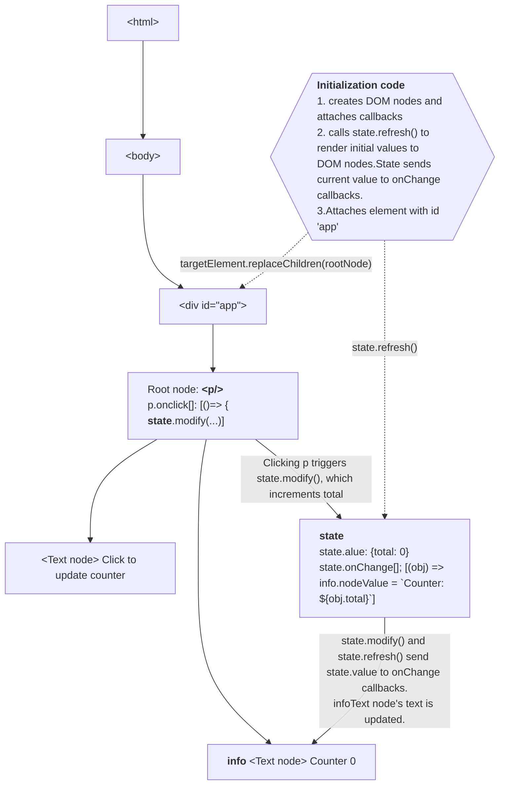

do# ki-frame

Lightweight browser framework for implementing SPAs. Code with DOM elements and listeners like it's 2010 again, but with
a functional approach.

<!-- TOC -->
* [Features, status and todo per feature](#features-status-and-todo-per-feature)
* [How are you supposed to use this?](#how-are-you-supposed-to-use-this)
  * [Use fluent syntax to create DOM trees](#use-fluent-syntax-to-create-dom-trees)
  * [Use createState() and state.onChange()](#use-createstate-and-stateonchange)
    * [How is the code linked to DOM nodes in memory?](#how-is-the-code-linked-to-dom-nodes-in-memory)
    * [How to structure code?](#how-to-structure-code)
    * [How to test?](#how-to-test)
  * [WIP Event propagation and state data sharing](#wip-event-propagation-and-state-data-sharing-)
    * [onRefresh](#onrefresh)
    * [onChange](#onchange)
    * [onDestroy](#ondestroy)
    * [Hierarchy and grouping](#hierarchy-and-grouping)
    * [Sharing state data](#sharing-state-data)
* [TODO](#todo)
<!-- TOC -->

# Features, status and todo per feature

* [domBuilder.ts](src/domBuilder.ts) - _wrapper for document.createElement() to create DOM trees fluently_
* [state.ts](src/state.ts) - _lightweight state management_
* validator - _lightweight zod clone for validating objects_
    * might better to use zod
* router - initialize application based on route parameters
    * port of https://github.com/mikko-apo/ki-router.js
    * work has not started
* headless testing
    * testing should be possible without a browser

# How are you supposed to use this?

## Use fluent syntax to create DOM trees

1. create DOM node trees with the fluent syntax. Extract a variable for each HTMLElement or Text node that you want
   access
   separately. Pass the variables how you want.

```typescript
import {a, p, setElementToId} from "./domBuilder";

const a1 = a("test link", {href: "/pow.html"});
setElementToId('app', p("POW!", a1, {onclick: () => console.log("pow.html")}));
```

## Use createState() and state.onChange()

If you need state, use createState({}) to create a typed state object. It's ok to share the state object
reference inside the application to other functions and DOM nodes. Use state.onChange() to react to changes in state.

State supports following functions for setting and notifying of state change:

- state.set(cur)
- state.modify(fn: (old) => cur)
- state.onChange(fn: (cur, old) => void): () => void

```typescript
import {p, setElementToId, text} from "./domBuilder";
import {createState} from "./state";

const createNodes = () => {
  const info = text();
  const root = p("Click to update counter", info);
  return {info, root};
};

function counter(state = createState({total: 0})) {
  const nodes = createNodes();
  nodes.root.onclick = () => state.modify((cur) => ({total: cur.total + 1}));
  state.onChange((obj) => (nodes.info.nodeValue = `Counter: ${obj.total}`));
  state.refresh();
  return nodes;
}

setElementToId('app', counter());
```

Example above forms following DOM nodes:

- &lt;p/> with onclick
    - Text node: "Click to update counter"
    - Text node: ""

In the initialization code, state.refresh() calls state's onChange listeners and text is included in to the Text node:

- &lt;p/> with onclick
    - Text node: "Click to update counter"
    - Text node: "Counter: 0"

&lt;p/> is attached to page DOM as a child of element with id 'app'.

Clicking on p increments counter with the help of the state:

- &lt;p/> with onclick
    - Text node: "Click to update counter"
    - Text node: "Counter: 1"

### How is the code linked to DOM nodes in memory?



It's probably a good practice to maintain a pyramid kind of shape for the DOM nodes that use the state. When
everything linked to the state is attached under a single DOM node, state will get cleaned up by the GC when the root
DOM node is removed from the main DOM tree.

For long-lived state objects, it might be beneficial to limit the creation of onChange() subscriptions. It's easy to
unsubscribe the onChange() subscriber, but it's difficult to maintain DOM node specific listeners over a complex code
base so leaks can become substantial if the onChange() is subscribed frequently for long-lived state objects.

### How to structure code?

For a single function:

- **parameters**: state objects (with types and default value in the signature), channels, functions (subcribe to
  onChange, onDestroy, unsubscribe)
- **body**: DOM structure setup, (initialize state,) connect subscribers, (render content with state.refresh())
- **return**: root node, newly created state objects, relevant nodes from testing

For reuse:

- extract DOM structure setup to its own function
- pass in state as parameter. other shared things can be given as parameters

For testing:

- extract subscribers to own functions and unit test each function separately
- snapshot DOM structure

Example:

```typescript
// DOM structure setup for testing
const createNodes = () => {
  const info = text();
  const root = p("Click to update counter", info);
  return {info, root};
};

function counter(state = createState({total: 0})) {
  const nodes = createNodes();
  // connect subscribers
  nodes.root.onclick = () => state.modify((cur) => ({total: cur.total + 1}));
  state.onChange((obj) => (nodes.info.nodeValue = `Counter: ${obj.total}`));
  // render content with state.refresh()
  state.refresh();
  return nodes;
}
```

### How to test?

[jsdom](https://github.com/jsdom/jsdom) makes it very easy to test ki-frame applications.

setJsdomApp() configures ki-frame to use jsdom for rendering DOM nodes and it setups a document
with "<div id='app'></div>". After calling ki-frame creates nodes works straight away and snapshots look like clean
HTML. .click() and its subscribers are processed synchronously in the background, so no need for awaits.

```typescript
describe("Example tests", () => {
  it("connected counter() and root.click()", () => {
    setJsdomApp();
    const {root, info} = counter(createState({total: 0}));
    expect(root).toMatchSnapshot();
    expect(info.nodeValue).toEqual("Counter: 0");
    root.click();
    expect(root).toMatchSnapshot();
    expect(info.nodeValue).toEqual("Counter: 1");
  });
});
```

Snapshot file contains the rendered HTML:

```javascript
// Vitest Snapshot v1, https://vitest.dev/guide/snapshot.html

exports[`Example tests > connected counter() and root.click() 1`] = `
<p>
  Click to update counter
  Counter: 0
</p>
`;

exports[`Example tests > connected counter() and root.click() 2`] = `
<p>
  Click to update counter
  Counter: 1
</p>
`;
```

## WIP Event propagation and state data sharing 

Browser apps are very fine-grained and functionality is distributed widely in to the DOM nodes. ki-frame uses a few
mechanisms to manage the complexity:

1. **Channels** are used to connect event sources to subscribers.
2. **Hierarchy and grouping** is used to simplify clean up of various resources
3. **Clearly defined event types** simplify app structure by defining straightforward ways to solve common issues:
   onChange and onDestroy

### onRefresh

### onChange

### onDestroy

### Hierarchy and grouping

1. State provides state.destroy() to remove the data value and close the state object for modification.
   state.onDestroy() and state.addToDestroy(destroyable) can be used to subscribe code for clean up, aborting and user
   information changes. When state.destroy() is called all destroy subscribers are notified and then subscriber are
   removed from the state.

```typescript
function onDestroyDemo() {
  const state = createState({total: 123})
  const info = (txt: string, s: State<Total>) => {
    const t = text()
    state.onChange(obj => t.nodeValue = `${txt}: ${obj.total}`)
    state.onDestroy(() => t.nodeValue = `${txt}: state destroyed`)
    return p(t);
  }
  const root = p(
    button(
      "Click me!",
      {onclick: state.destroy}
    ),
    info("1", state),
    info("2", state)
  );
  state.refresh(); // render initial data
  return root;
}
```

notes:

- state.destroy() does not send onChange() event
- If you have rootState and childState and you want to possibly destroy the childState separately, use
  childState.addToParentDestroy(rootState) to ensure that childState removes itself from the rootState's destroyable
  list when childState.destroy() is called.

1. In addition to onChange(), state supports channels that can be used to send typed messages to subscribers. Channels
   can be used to implement shared teardown etc functionality.

2. If you need fetch(), use fetchWithState():

3. If you need state with long-lived event listeners, timers, observables, promises, websockets, eventsource, workers,
   global
   caches/registries, object properties on long-lived objects etc use state.destroy() and state.onDestroy() to trigger
   cleanups. If you have different levels of hierarchy and cascading/recursive state.destroy(), use
   state.createAttachedState() and state.destroy() on suitable state.

### Sharing state data

|                     | Description                                    | States connect to shared value                      | Destroy propagates | onChange propagates  |
|---------------------|------------------------------------------------|-----------------------------------------------------|--------------------|----------------------|
| state.copy()        | Creates a copy fr                              |                                                     |                    | default: Both ways   |
| state.pick("field") | Selects a field from the original state.value. | Modifications are reflected on all connected states | By default         | All connected states |
|                     |                                                |                                                     |                    |                      |

# TODO

* example of inversion of control, instead of sprinkling functionality to element handlers, do it with main code
* domBuilder: Add support for WrappedNode.getNode to enable helper apis for elements
* state: Example for onclick -> fetch -> display
* state: Example for form
* propagation of refresh() and destroy() using a similar mechanism, maybe runtime parameter
    * state.refresh("all"|"linked"|"this")
    * state.destroy("all"|"linked"|"this")
    * maybe when linking parent and child state, the accepted events should be listed: {destroy: true, refresh: true,
      onchange: (state) => {...}}
        * default should be: {destroy: true, refresh: true}
    * maybe onChange should include onDestory subscribtion too
    * Create a diagram to explain how to changes and destroys work together
* reducer()
* pick()
* state.fetch() - fetch attached to a state so that state.destroy() aborts the fetch
* promiseToState: should unattach from parentState once promise fulfills or rejects
* domBuilder: separate classic and extended api. extend text()
* domBuilder: Configure createElement partial attribute types with JSX.IntrinsicElements[T] to get props for
  HtmlElements
